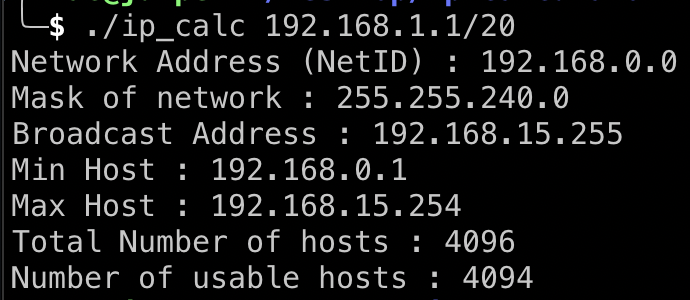

# ip-calculator

Tool for calculating ip address (net and broadcast) also other informations

You can provide 1 argument, ip address followed by prefix (CIDR Notation)

the output of program will provide you with netID or netword Address, broadcast, mask and pool of ip address

